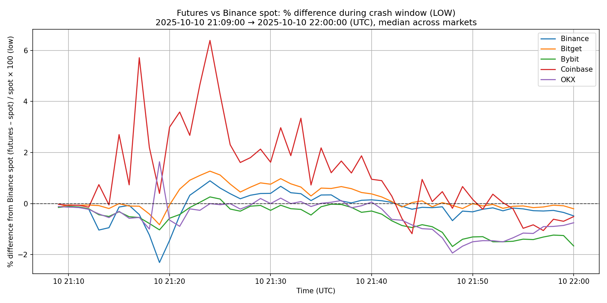
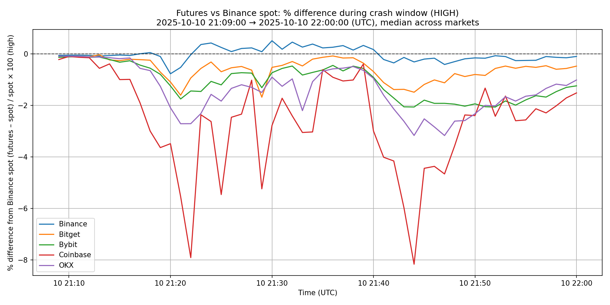
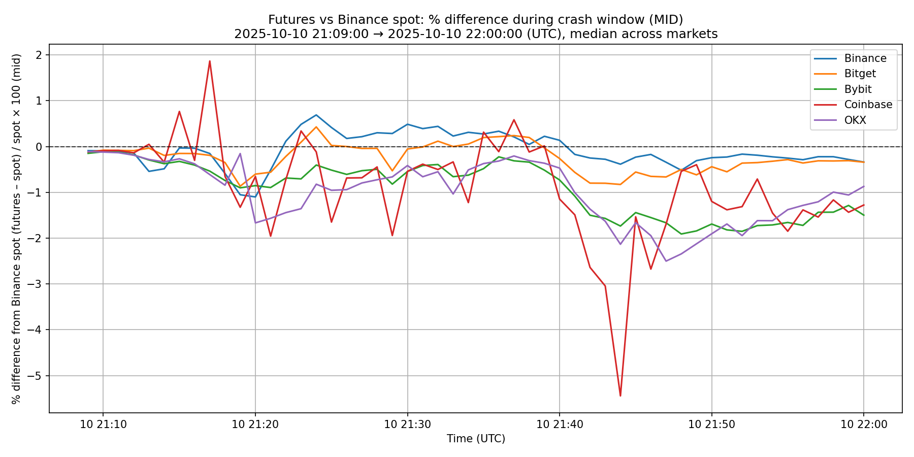
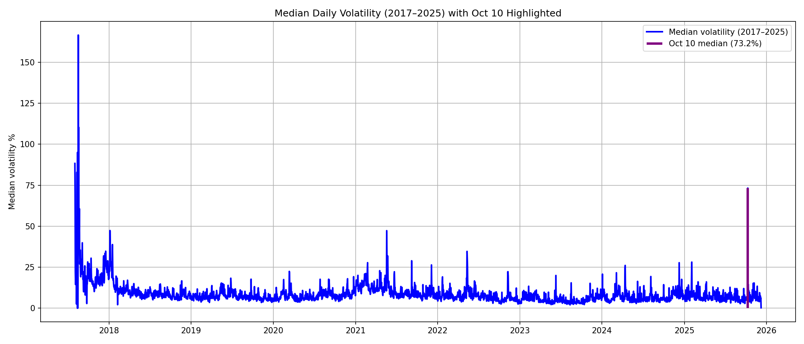

# Oct 10, 2025 — Extreme Event Analysis

This repo is a small case study on the Oct 10th crypto crash using data from my OHLCV databases.  
It’s not meant to be production code — just a clean look at how insane that day actually was across spot and futures markets.

## What's in here
Each script looks at the event from a different angle:

### `oct_10th_stats.py`
Compares Oct 10’s drop/pump/range % against the entire Binance spot history (2017–2025) and shows how many **standard deviations** out of line the day was.

### `volatility_binance_2017_2025.py`
Builds a long-term median volatility series and highlights where Oct 10 sits.

### `oct_10th_liq_vol.py`
Adds up USD-denominated traded volume during the liquidation window (21:09–22:00 UTC) across multiple exchanges (spot + futures).

### `volatility_spot_basis_all_exchanges_vs_binance_spot.py`
Shows how far futures drifted from Binance spot during the crash — mid, high, and low — aggregated across markets.

### `markets_with_largest_intraday_drop_1d.py`
Ranks which Binance spot markets had the steepest intraday crash.

### `plot_candles_from_db.py`
Quick helper to visualize the candles around the crash window for any market.

---

## Example Outputs (all files are in this folder)

### **Futures vs Binance Spot (LOW basis)**
`median_low_basis_vs_binance_spot_2025-10-10_2109_2200.png`  

### **Futures vs Binance Spot (HIGH basis)**
`median_high_basis_vs_binance_spot_2025-10-10_2109_2200.png`  

### **Futures vs Binance Spot (MID basis)**
`median_mid_basis_vs_binance_spot_2025-10-10_2109_2200.png`  

---

### **Long-term volatility with Oct 10 highlighted**
`median_volatility_2017_2025_with_oct10.png`  

---

### **Candle reconstruction examples**

`2025-12-09 09.09.48.jpg` — **RENDER/USDT**  

`2025-12-09 09.09.44.jpg` — **ATOM/USDT** with liquidation wick  

`2025-12-09 09.09.40.jpg` — **ENJ/USDT** deep micro-structure break  

---

## Why this repo exists
My main project (`1minArbitrageTools`) handles all the data collection and infra.  
This repo is the “analysis notebook” version — focused on a single extreme day where markets behaved unlike anything you normally see.

If you're reading this from the outside: yes, Oct 10 really was that ridiculous.
